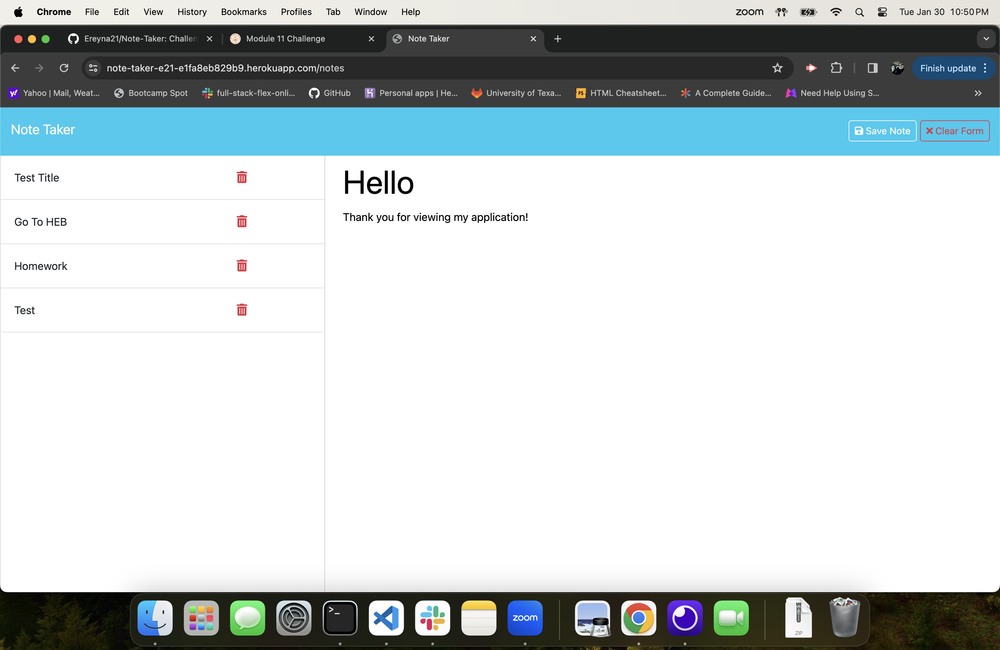

# Note-Taker

## License
  

  This project is licensed under the MIT license.
  
<a href= "https://choosealicense.com/licenses/mit/">link to MIT license</a>

## Description
To have an everyday Note-Taker to jot down anything you dont want to forget.

## Table of Contents
- [License](#license)
- [Installation](#installation)
- [Usage](#usage)
- [Contributing](#contributing)
- [Tests](#tests)
- [Questions](#questions)

## Installation
Express.js, node.js, and Heroku to deploy application.

## Usage
When you run application, you hit the button Get Started. Then you will be directed to the note application where you can write titles and text of any information that you would like to be stored and not for future refrences. When you have any data entered into title and text location then the save note button , along with the clear form button will appear to save or clear text. you can then click on data in storage section to refrence back to information or you can delete content when you no long need that information.

## Contributing
Eric Reyna

## Tests
N/A

## Questions
For additional questions, you can reach me through:
- GitHub: [Ereyna21](https://github.com/Ereyna21)
- Email: Ereyna21075@gmail.com

Live Link: https://note-taker-e21-e1fa8eb829b9.herokuapp.com/

Repository Link: https://github.com/Ereyna21/Note-Taker

